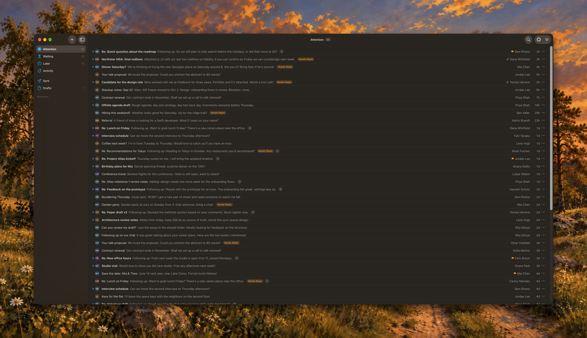

# Folio

A native macOS email client written in Swift. Mail syncs into a local SQLite database, and the app reads from that database, so browsing and search work offline.



## Features

- Gmail, Fastmail (JMAP), and generic IMAP/SMTP accounts, plus a local demo account that needs no sign-in
- Conversation views (Attention, Waiting, Later) inferred from who wrote last, with manual overrides
- Activity feed that groups receipts, security alerts, notifications, and newsletters away from people
- Unified inbox, threads, full-text search, compose, reply, and forward
- Ask Mail: questions about your mail answered on-device with Apple Foundation Models when available

Microsoft 365 / Outlook support is planned.

## Requirements

- macOS 27 or later
- Xcode 27 or later (Swift 6.4 toolchain)

## Getting started

1. Clone the repository and copy the local config:

   ```sh
   cp Config/Local.xcconfig.example Config/Local.xcconfig
   ```

2. In `Config/Local.xcconfig`, set `DEVELOPMENT_TEAM` to your Apple team ID so Xcode can sign the app.
3. Open `Folio.xcodeproj` and run the `Folio` scheme.

Without a Google client ID the app still runs. Add the demo account, a Fastmail account (API token), or an IMAP account from **Add Account**.

### Gmail sign-in

Gmail needs your own OAuth client:

1. In the [Google Cloud Console](https://console.cloud.google.com/), create a project and enable the Gmail API.
2. Configure the OAuth consent screen and add yourself as a test user.
3. Create an OAuth client ID of type **iOS**. A Desktop client fails because it requires a client secret. Use the app's bundle ID (`re.leob.Folio` unless you change `PRODUCT_BUNDLE_IDENTIFIER`).
4. Put the client ID in `Config/Local.xcconfig`:

   ```
   GMAIL_CLIENT_ID = 1234567890-abc.apps.googleusercontent.com
   ```

The app requests the `gmail.modify` scope. `Config/Local.xcconfig` is git-ignored; never commit it.

## Development

The app target is a thin shell. The code lives in a Swift package under `Packages/`:

| Module     | Contents                                                      |
|------------|---------------------------------------------------------------|
| `Domain`   | Models and rules (conversation state, activity classification). No UI, network, or database dependencies. |
| `Data`     | GRDB/SQLite schema, migrations, repository, and outbox.        |
| `Platform` | Provider clients and sync (Gmail, JMAP, IMAP/SMTP), OAuth, Keychain. |
| `Features` | SwiftUI and AppKit views with their models.                    |

Run the tests:

```sh
cd Packages
swift test
```

Build the app from the command line:

```sh
xcodebuild -scheme Folio -destination 'platform=macOS' build
```

More detail is in [`docs/`](docs): [product](docs/product.md), [architecture](docs/architecture.md), [decisions](docs/decisions.md), [conventions](docs/conventions.md), and [UI](docs/ui.md).

## Contributing

See [CONTRIBUTING.md](CONTRIBUTING.md).

## License

Folio is licensed under the [GNU Affero General Public License v3.0](LICENSE).
